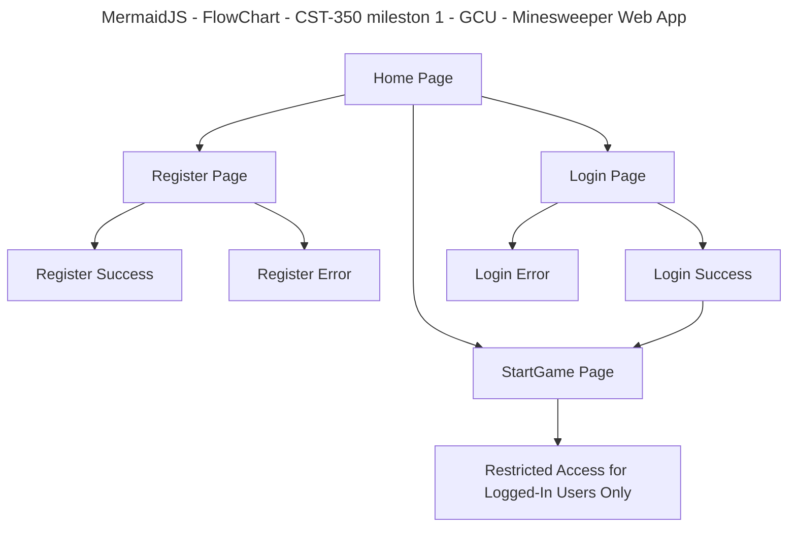
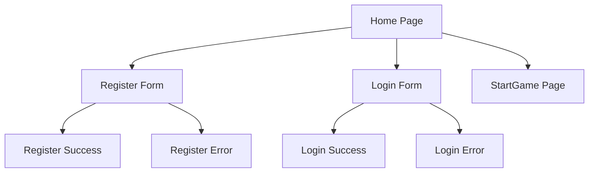
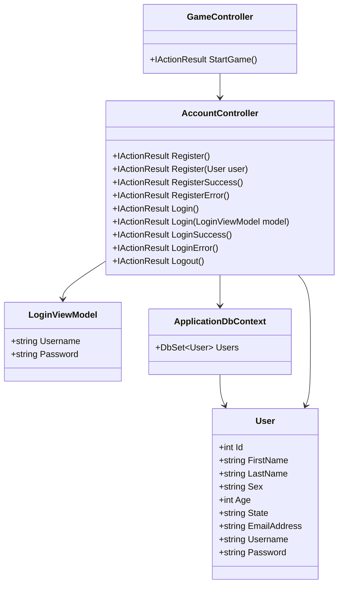

# Grand Canyon University (GCU) CST-350 - Minesweeper Web App - Milestone 1

## Login and Registration Modules

#### Project Status and Design Report

| User Story | Team Member | Hours Worked | Hours Remaining |
|--|--|--:|--:|
| Part 1 - Register Form | Hector Gonzalez | 4 | 0 |
| Part 2 - Login Form | Hector Gonzalez | 4 | 0 |
| Part 3 - Restrict Access to StartGame | Hector Gonzalez | 3 | 0 |
| Word Documantation - Descriptions and Screenshots | Mikkos Thomas | 3 | 0 |

#### Planning Documentation

###### Initial Planning

For Milestone 1, the goal was to build the user management portion of the Minesweeper web application. 
The application needed to allow a new user to register with personal information, allow an existing user to log in using a username and password, and restrict access to the StartGame page unless the user is logged in. 
The milestone also required server-side validation, SQL Server database storage, and session handling to track login status.

###### Retrospective Results

One thing that went well in this milestone was setting up the basic ASP.NET Core MVC structure with models, views, and controllers. 
The registration and login pages were able to connect to the controller actions and database logic. 
One challenge was fixing routing and view file issues, such as making sure the controller names, action names, namespaces, and view folders matched correctly. Another challenge was setting up session handling so that the StartGame page could only be accessed by logged-in users.

#### Design Documentation

###### General Technical Approach

The application was developed using ASP.NET Core MVC. 
The MVC design pattern helped separate the project into Models for user data, Views for the user interface, and Controllers for handling requests and application logic. 
Entity Framework Core was used to connect the application to a SQL Server database. 
The registration form sends data to the controller using an HTTP POST request, validates the form data on the server side, and stores the user record in the database. 
The login form checks the entered username and password against the database and stores the user login state in a session variable. The StartGame page checks the session variable before allowing access.

###### Key Technical Design Decisions

- ASP.NET Core MVC was used to organize the project into a clean Model-View-Controller structure.
- Entity Framework Core with SQL Server was used for storing and retrieving user account information.
- Data annotation attributes such as `[Required]`, `[EmailAddress]`, and `[Range]` were used for server-side validation.
- Session variables were used to store login state and restrict access to the StartGame page.
- Bootstrap styling was used to improve the appearance of the Register and Login pages.

###### Risks

- Namespace mismatches between models, views, and controllers could prevent views from loading correctly.
- Missing view files such as RegisterSuccess or LoginSuccess could cause runtime errors.
- Session configuration problems could prevent the application from properly restricting access.
- Incorrect database connection string settings could stop registration and login from working.

###### Division of Work (Group Approach)

This milestone was completed as a group. All work including project setup, database configuration, model creation, controller logic, view creation, session management, debugging, testing, screenshots, and documentation was completed by Hector Gonzalez, and Mikkos Thomas.

## Sitemap Diagram

- The sitemap shows the basic flow of the application for Milestone 1. A user begins on the Home page and can navigate to Register, Login, or StartGame. Register submits the user information and routes to either a success or error page. Login checks the credentials and routes to either a success or error page. The StartGame page is restricted and should only be accessible after the user has logged in.

## User interface Diagram

- The user interface for this milestone includes a Home page with navigation links, a Register form, a Login form, success and error pages for both features, and a restricted StartGame page with placeholder text.

## Class Diagram

- This class diagram shows the main classes used in Milestone 1. The User model stores registration data, the LoginViewModel handles login input, the ApplicationDbContext connects the project to the SQL Server database, the AccountController manages registration and login requests, and the GameController handles the restricted StartGame page.

## Service API Design (if applicable)

This milestone does not include a REST API. The project currently uses MVC controller actions and Razor views for page routing and form submission.

## Security Design

For Milestone 1, security is implemented at a basic level by restricting access to the StartGame page unless the user is logged in. A session variable is used to track whether the user has successfully logged in. When the user attempts to access the StartGame page without logging in, the application redirects the user to the Login page and displays a warning message. Server-side validation is also used on the Register and Login forms to ensure valid data is submitted.

## Miscellaneous

This milestone demonstrates the foundation for the Minesweeper web application. Before the game logic can be added in Milestone 2, the application first needs a working user registration and login system. This milestone also helped establish the project structure, routing, database setup, and user session handling that will be used in later milestones.

## Screencast URL

- [My Presentation]()

In this presentation, I demonstrate the Register form, Login form, session-based access restriction for the StartGame page, and the main controller, model, and database code used to implement Milestone 1.

## Summary

In this milestone, I created the user registration and login system for the Minesweeper web application. The Register form collects user information, validates it on the server side, and saves it into a SQL Server database. The Login form checks the username and password against the database and stores the user’s login state in a session variable. I also created a restricted StartGame page that only logged-in users can access. This milestone demonstrated important web development concepts including ASP.NET Core MVC, server-side validation, database connectivity, session management, routing, and access control.
